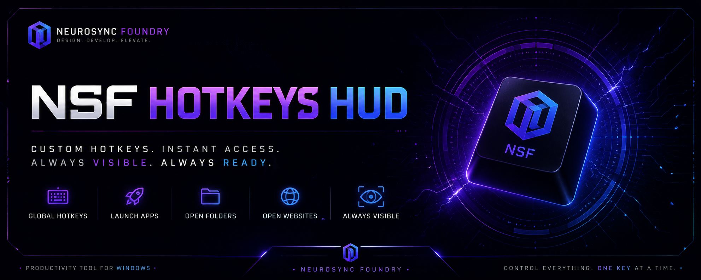

<div align="center">



</div>

<div align="center">

# NSFHotkeysHUD

**Modern desktop overlay for custom hotkeys.**

Display your keyboard shortcuts directly on your screen and launch applications, folders or websites in seconds.

**Developed by NeuroSync Foundry**

---


</div>

---

## 📖 About

**NSFHotkeysHUD** is a Windows application that allows you to create custom global hotkeys for launching applications, folders and websites while displaying them in a clean on-screen overlay.

Instead of remembering dozens of shortcuts, your hotkeys remain visible at all times.

---

## ✨ Features

* 🎹 Custom global hotkeys
* 📂 Launch folders instantly
* 🚀 Launch applications
* 🌐 Open websites
* 🖥 Always-visible Hotkeys HUD
* ⚡ Lightweight and fast
* 🎨 Modern interface
* 🌍 Multi-language installer
* 🔄 Optional startup with Windows

---

## 📷 Screenshots

Screenshots will be added in future releases.

---

## 🚀 Installation

1. Launch the installer.
2. Select your preferred language.
3. Accept the License Agreement.
4. Choose the installation directory.
5. Optionally create a desktop shortcut.
6. Click **Install**.
7. Launch **NSFHotkeysHUD**.

---

## ⚙ First Launch

After installation you can:

* Add your own hotkeys
* Configure overlay appearance
* Enable automatic startup with Windows
* Customize program behavior

---

## 💡 Example

```
Ctrl + Alt + D   → Open Discord
Ctrl + Shift + G → Launch GitHub
Alt + F1         → Open Projects folder
Ctrl + Alt + W   → Open Website
```

---

## 🛣 Roadmap

* [x] Custom hotkeys
* [x] Overlay HUD
* [x] Multi-language installer
* [x] Windows startup support
* [ ] Themes
* [ ] Import / Export configuration
* [ ] Hotkey profiles
* [ ] Plugin support
* [ ] Cloud synchronization

---

## 🛠 Built With

* Python
* PySide6
* Windows API

---

## 📄 License

This project is licensed under the **MIT License**.

---

## ❤️ NeuroSync Foundry

NSFHotkeysHUD is one of the utilities developed under the **NeuroSync Foundry** ecosystem, focused on creating modern productivity tools and desktop software.
